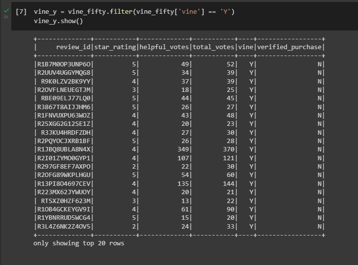
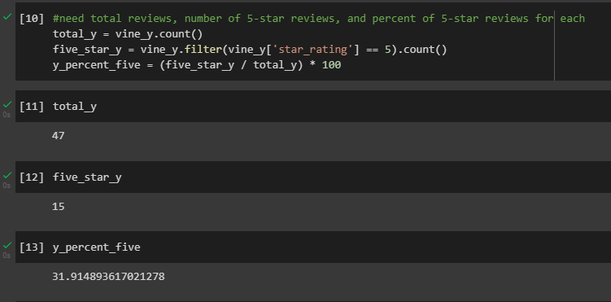

# Amazon Vine Analysis
In this challenge, we take a look at a category of items sold on Amazon. We specifically look at users that are part of the "Vine" review program. Through analysis, I determine if the category I selected, wrist watches, has biased reviews by those who are a part of the "Vine" program.

## Results
From the analysis that was run, I determined several things:

First, I loaded the data into a usable table:

Using code from the images below, I was able to filter all Vine reviewers' reviews and get a count, 5-star review count, and 5-star reviews percentage.

- There were 47 reviews left by Vine reviewers.
- Out of those, there were 15 5-star reviews.
- Of all reviews left by Vine reviewers, 31.91% were 5-star reviews.

