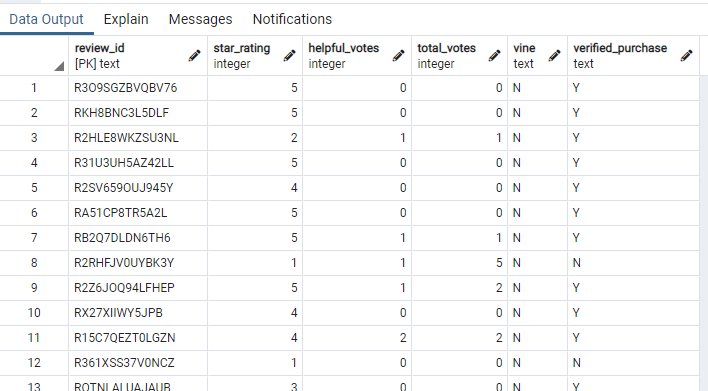

# Amazon Vine Analysis
In this challenge, we take a look at a category of items sold on Amazon. We specifically look at users that are part of the "Vine" review program. Through analysis, I determine if the category I selected, wrist watches, has biased reviews by those who are a part of the "Vine" program.

## Results
From the analysis that was run, I determined several things:

First, I loaded the data into a usable table:

Using code from the images below, I was able to filter all Vine reviewers' reviews and get a count, 5-star review count, and 5-star reviews percentage.

- There were 47 reviews left by Vine reviewers.
- Out of those, there were 15 5-star reviews.
- Of all reviews left by Vine reviewers, 31.91% were 5-star reviews.

---
I then collected the same information for non-vine reviews.

- There were 8362 reviews left by independent reviewers.
- Out of those, there were 4332 5-star reviews.
- Of all reviews left by independent reviewers, 51.81% were 5-star reviews.

## Summary
After running the analysis for watches, I was surprised to find only a small amount of Vine reviewers. Only 32% of reviews left by Vine reviewers were 5-star reviews, whereas 52% of non-vine reviews were 5-star. This leads me to believe that there is no positivity bias for vine reviewers, at least in this watch dataset. This could be explained by the simple fact that watches are a luxury item. Perhaps luxury items are less inclined to use Vine and provide products to them because the items are typically more expensive and don't follow sales trends of more common items.

To further explore this, an additional study could analyze all reviews, not just 5-star reviews. We could take the mean of all reviews for both vine and not-vine samples to see what the average review score was for each group. We could then run the same analysis for 1, 2, 3, and 4 star reviews, to see if Vine is more inclined to leave a review above 3-stars, which could elude to positivity bias.
